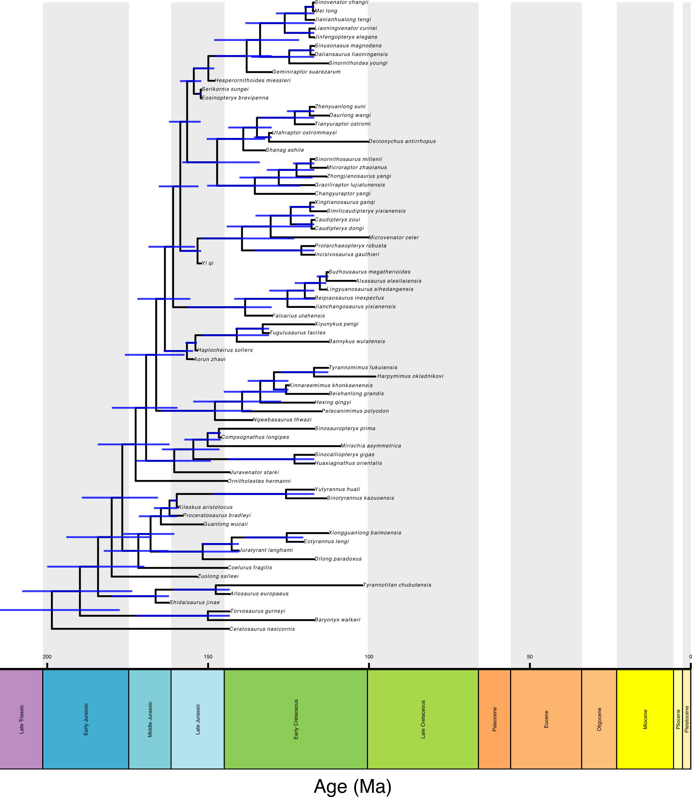

```{r setup, include=FALSE}
knitr::opts_chunk$set(echo = TRUE)
```

\


# Dating a Super Tree using the FBD model

###### Thanks to **David Černý** for his help developing this code.

In paleobiology there are often situations where we want to date a supertree, or any tree for which we do not have any character data associated with taxa at the tips. This is commonly carried out in MrBayes, though it is also possible to do in RevBayes.The following tutorial provides sample code for dating a super tree of dinosaurs? (need to check this) in Revbayes using the Fossilized Birth death model. 
The data is from *Tasimov et al. (in prep)* and is of XX taxa with ages ranging from XX to XX.

Note: This tutorial uses both R and RevBayes for steps of the inference. RevBayes is under active development and will eventually provide a approach to carry out the full analysis .... coming soon-ish......

## Organise you code 
As with any analysis it is important to set up you directories correctly. You should have a scripts and a data folder.
The trees and fossils ages can be downloaded [here](data/dino_data.zip)

## 1. Time-scaling the tree in R

For this inference Revbayes requires a time-scaled tree as the input. We can carry out this time-scaling in R studios. The exact method of time scaling used here _should not_ have an impact on the over all inference results. We can use the R package `paleotree` to do this. Additionally, if your tree has polytomies we need to provide RevBayes with a fully resolved tree as the initial tree and the original tree is then supplied as the so called backbone tree. In this way the polytomies can be resolved by leveraging the temporal information during the FBD analysis. 

We first need to read in our age data and create a matrix of ages required for the time scaling method

```{r timedata_r, eval=FALSE}
taxa_ages <- read.table("data/ages.csv", header = T)
rownames(unique_taxa_ages) <- unique_taxa_ages[,1]
dinoRanges <- unique_taxa_ages[,2:3]
```

We can read in our tree 

```{r readintree_r, eval = FALSE}
phy <- ape::read.tree("data/dino.tree")
```

We then borrow a function from Liam Revell's [website](http://blog.phytools.org/2017/06/generating-set-of-random-resolutions-of.html) for randomly resolving polytomies 

```{r polytomiesf, eval = FALSE}

resolveRandom<-function(tree){
  while(!is.binary(tree)){
    nodes<-1:tree$Nnode+Ntip(tree)
    Nchildren<-function(node,tree) length(Children(tree,node))
    nchilds<-sapply(nodes,Nchildren,tree=tree)
    node<-nodes[which(nchilds>2)[1]]
    tree<-sample(resolveNode(tree,node),1)[[1]]
  }
  tree
}


Binary_tree <- resolveRandom(phy)
```

Using the function `timePaleoPhy` in the PaleoTree package we can estimate branch length with units of time for our trees (the original tree and the fully resolved, or binary, tree). The `type` variable here refers to the time scaling appraoch used. We are using "mbl" which ensures that there are no zero branch lengths, which is a common result when using the "basic" method. 

```{r paleoTree, eval=FALSE}
tt_polytomy <- paleotree::timePaleoPhy(tree = phy, timeData = dinoRanges, type = "mbl", randres = FALSE,
                                       ntrees = 1, plot= T, vartime = 2)


tt_binary <-  paleotree::timePaleoPhy(tree = Binary_tree, timeData = dinoRanges, type = "mbl", randres = FALSE,
                                      ntrees = 1, plot = T, vartime = 2)


```

Now we can write the trees to file to use them for our FBD inference
```{r writeTrees, eval=FALSE}
write.tree(tt_polytomy,"data/dated_backbone.tre")
write.tree(tt_binary,"data/dated_initial.tre")
```


## 2. FBD inference in RevBayes
Below I will provide the code for estimating divergence times of a super tree using the FBD model. It is important to note that this code works by **fixing the fossil ages**. This has been shown to be problematic, see [Barido-Sottani et al 2020](https://www.frontiersin.org/journals/ecology-and-evolution/articles/10.3389/fevo.2020.00183/full), however is currently the only practical implementation. The new release of RevBayes will allow you to estimate these ages, so keep an eye out for that! 

As with any analysis it is helpful to give it a name

```{r analysis_name, eval = FALSE}
analysis_name = "Palss_2024"
```

We can then read in our age information 

```{r ageinfo, eval = FALSE }
### read in the age infromation 
taxa <- readTaxonData("data/ages.csv")
```


Read in our backbone tree (i.e., our original tree with polytomies)
```{r back, eval=FALSE}
## read in the backbone tree - the one with ploytomies 
bb <- readTrees("data/datedbackbone.tre")[1]
```

As there is no explicit information in our newick string about the age of the tree we need to offet it by the age of the youngest fossil

```{r offset, eval=FALSE}
## offset the ages by the age of the youngest tip
bb.offset(98)
```


We can do the exact same for the starting tree

```{r init, eval=FALSE}
init <- readTrees("data/dated_initial.tre")[1]
init.offset(98)
```


We can then set the priors on our FBD paramters: speciation, extinction, and sampling

```{r FBD, eval = FALSE}
speciation_rate ~ dnExponential(10)
extinction_rate ~ dnExponential(10)

moves.append( mvScale(speciation_rate, lambda=0.01, weight=1) )
moves.append( mvScale(speciation_rate, lambda=0.1,  weight=1) )
moves.append( mvScale(speciation_rate, lambda=1.0,  weight=1) )

moves.append( mvScale(extinction_rate, lambda=0.01, weight=1) )
moves.append( mvScale(extinction_rate, lambda=0.1,  weight=1) )
moves.append( mvScale(extinction_rate, lambda=1,    weight=1) )


psi ~ dnExponential(10)
moves.append( mvScale(psi, lambda=0.01, weight=1) )
moves.append( mvScale(psi, lambda=0.1,  weight=1) )
moves.append( mvScale(psi, lambda=1,    weight=1) )

```

We can keep track of parameters of interest during the analysis 
```{r div, eval=FALSE}
diversification := speciation_rate - extinction_rate
turnover := extinction_rate/speciation_rate
```

As our tree is fully extinct we can set rho, the probability of extant species sampling, to zero
```{r rho, eval=FALSE}
rho <- 0
```

The root age is set using a uniform prior on the start of the Triassic and the oldest fossil

```{r origin, eval=FALSE}
root_age ~ dnUniform(170.9, 251)
moves.append( mvSlide(root_age, delta=0.1, weight=5) )
```


Having defined all our parameters we can create our FBD object
```{r fbd_obj, eval=FALSE}
fbd_dist = dnFBDP(rootAge=root_age, lambda=speciation_rate, mu=extinction_rate, psi=psi, rho=rho,taxa=taxa)
```

The FBD tree is constrained using both of the time trees
```{r const, eval=FALSE}
fbd_tree ~ dnConstrainedTopology(fbd_dist, backbone=bb, initialTree=init)

moves.append( mvFNPR(fbd_tree, weight=15.0) )
moves.append( mvCollapseExpandFossilBranch(fbd_tree, root_age, weight=6.0) )
moves.append( mvNodeTimeSlideUniform(fbd_tree, weight=40.0) )
```

Record the number of sampled ancestors
```{r sa, eval=FALSE}
num_samp_anc := fbd_tree.numSampledAncestors()
```


Define our model
```{r model, eval=FALSE}
mymodel = model(fbd_tree)
```


Define some monitors 
```{r mons, eval=FALSE}
# 1. for the full model #
monitors.append( mnModel(filename="output/" + analysis_name + "_dino.log", printgen=10, exclude = ["F"]) )

# 2. the tree #
monitors.append( mnFile(filename="output/" + analysis_name + "_dino.trees", printgen=10, fbd_tree) )

# 3. and a few select parameters to be printed to the screen #
monitors.append( mnScreen(printgen=1000, root_age) )

```


Finally, initialise and run our inference 
```{r run, eval=FALSE}
# Initialize the MCMC object #
mymcmc = mcmc(mymodel, monitors, moves, nruns=2, combine="mixed")


mymcmc = mcmc(mymodel, monitors, moves)
mymcmc.run(generations=10000)
```


Create a summary tree 
```{r sumTree, eval = FALSE}
trace = readTreeTrace("output/" + analysis_name + "_dino.trees")
mccTree(trace,"output/" + analysis_name + "_dino_mcc.tre", positiveBranchLengths = TRUE)
```

Note: this will not converge! The chain needs to be run for a lot longer, but that is ok for the purposes of this tutorial. 

## 3. Tree visualization in R
We can plot our time tree in R using the R package `RevGadgets`. This R package provides lots of cool ways for processing the output of a phylogentic inference in RevBayes, for more information [see](https://revbayes.github.io/tutorials/intro/revgadgets.html)


```{r plotData, eval=FALSE}
library(RevGadgets)
file <- "output/Palss_2024_dino_mcc.tre"
FBD_tree <- RevGadgets::readTrees(paths = file)

```


As before we need to include our offset, so we add 98 to the posterior of tree
```{r ospost, eval = FALSE}
FBD_tree[[1]][[1]]@data[["age_0.95_HPD"]]<- 
  lapply(FBD_tree[[1]][[1]]@data[["age_0.95_HPD"]], function(x) x + 98)

```

Create our plot
```{r plot-p, eval = FALSE}
p <- plotFBDTree(tree = FBD_tree, 
            timeline = T, 
            geo_units = "epochs",
            tip_labels_italics = T,
            tip_labels_remove_underscore = T,
            tip_labels_size = 1, 
            tip_age_bars = T,
            node_age_bars = T,
            age_bars_color = "blue",
            label_sampled_ancs = TRUE,
            line_width = 0.5,
            age_bars_width = 0.5)

```

Add our offset to the tree object and plot
```{r plot, eval = FALSE}
p$data$x <- p$data$x - 98
p
```

You should end up with a tree like this:

```{r, echo=FALSE,  out.width="50%",out.extra='style="padding:5px"'}

```


You can play with the plotting function to make this tree look nicer! Download the complete scripts for this tutorial [here](scripts/dino.zip)

