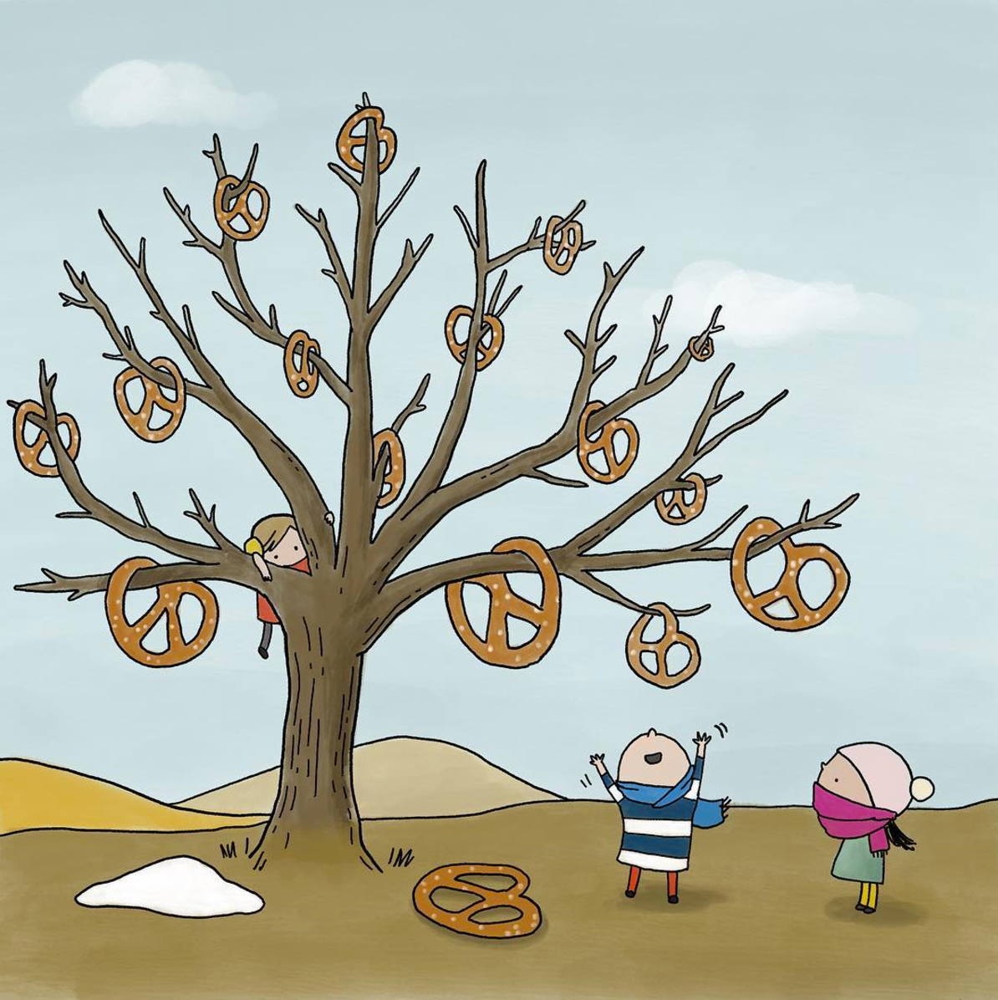

\

```{r, echo=FALSE, out.width="50%",  out.extra='style="float:right; padding:40px"'}
# https://www.behance.net/gallery/47366833/Pretzel-Tree

```

Welcome to the [Palaeontological Association Annual Meeting](https://www.palass.org/meetings-events/annual-meeting/2024/annual-meeting-2024-erlangen-germany-overview) in Erlangen and to the *Fossil sampling biases and phylogenetics* workshop!

The workshop will take place on **Tuesday 10.12.24 9:00–12:30** in the seminar room on the ground floor of the main [FAU University Library](https://maps.app.goo.gl/XwGjd29gxTPEPmfp6) (just 10 minutes from the station).

There are no fees associated with this workshop. You just need to come along with your laptop!

Instructors: Bethany Allen (ETHZ), Laura Mulvey (QMUL), Rachel Warnock (FAU), Joëlle Barido-Sottani (ENS), Tim Brandler (FAU), Alessio Capobianco (LMU), Robert Haobo Yuan (ETHZ)

# Before the workshop

## Software

Ahead of the workshop please install the following software:

- [RevBayes (v 1.2.4)](https://revbayes.github.io/download)
- [Tracer](https://github.com/beast-dev/tracer/releases/tag/v1.7.2)
- [FigTree](http://tree.bio.ed.ac.uk/software/figtree/)
- [R](https://www.r-project.org)

If you encounter any installation issues, please get in touch beforehand - describe the issue and provide details of the computer and operating system you're using.

## Recommended reading

- *Understanding the tripartite approach to Bayesian divergence time estimation* [Warnock & Wright, 2020](https://ecoevorxiv.org/repository/view/4372/)
- *Total-evidence dating and the fossilized birth–death model* [Gavryushkina & Zhang, 2021](https://academic.oup.com/sysbio/article/65/2/228/2427164)
- *Assessing the effect of time-scaling methods on phylogeny-based analyses in the fossil record* [Bapst, 2016](https://www.cambridge.org/core/journals/paleobiology/article/assessing-the-effect-of-timescaling-methods-on-phylogenybased-analyses-in-the-fossil-record/082F239A2512CC09E51181F9B499D1A3)

PDFs available here: https://tinyurl.com/ycy9bjka 

## Recommended videos

We also recommend the Paul Lewis Phyloseminar lecture series (especially parts 1, 2, and 3a). These provide a really great intro to some of the theory we'll be covering.

- [Phylogenetics primer part 1](https://www.youtube.com/watch?v=1r4z0YJq580)
- [Phylogenetics primer part 2](https://www.youtube.com/watch?v=UsLeY0wZr4Y&t=1614s)
- [Phylogenetics primer part 3a](https://www.youtube.com/watch?v=4PWlnNsfz90)
- [Phylogenetics primer part 3b](https://www.youtube.com/watch?v=TLtOS--YwkU)

## Any questions?

Email rachel.warnock@fau.de

\
\

Image source: Cathy Wu via behance.net

