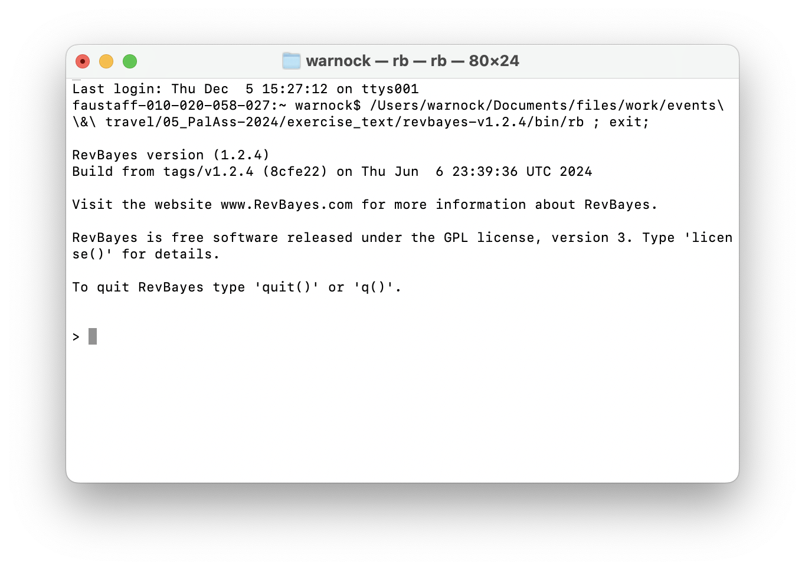
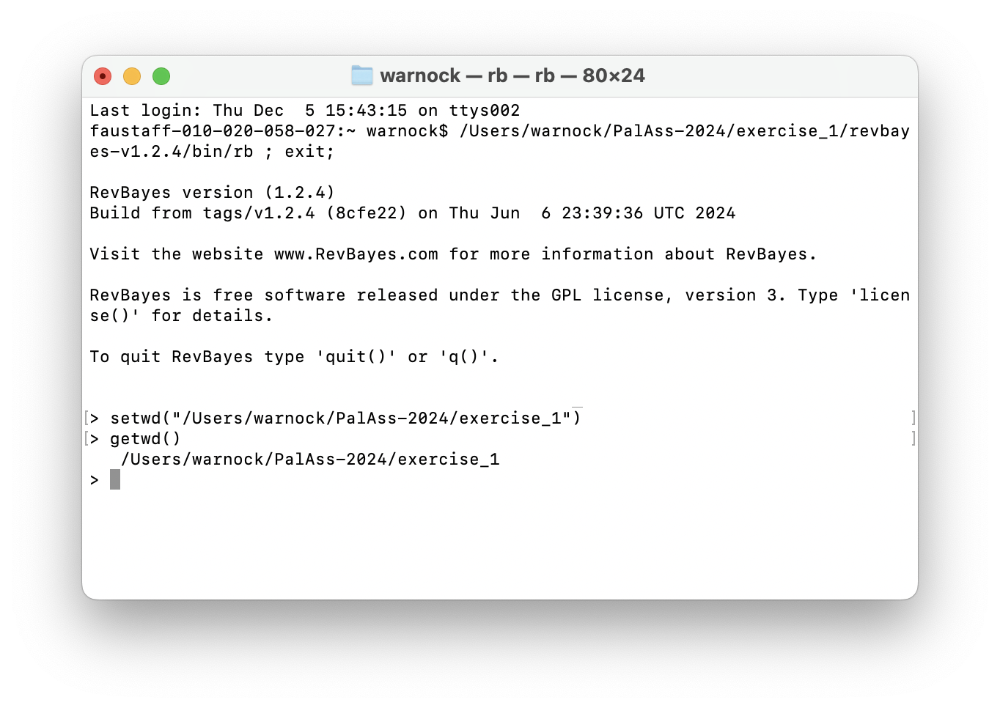
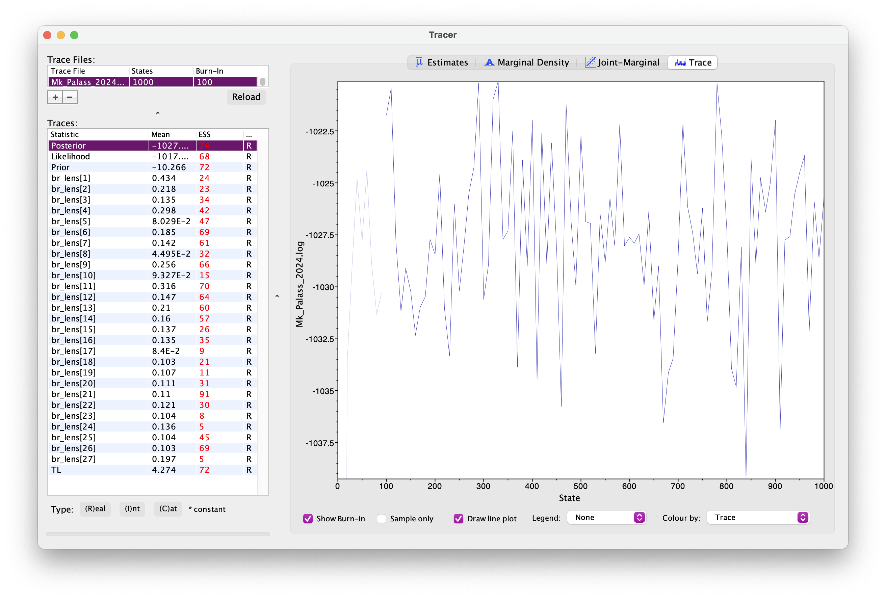
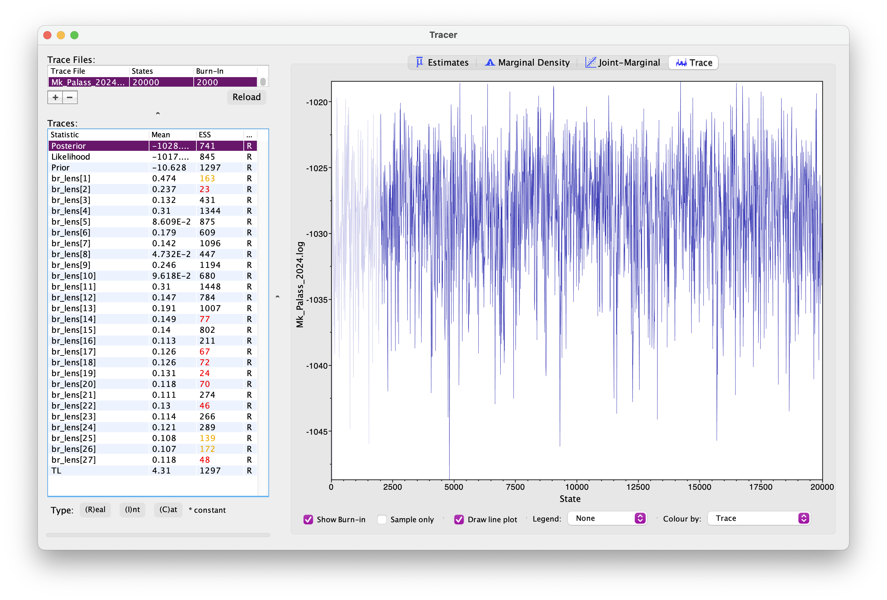
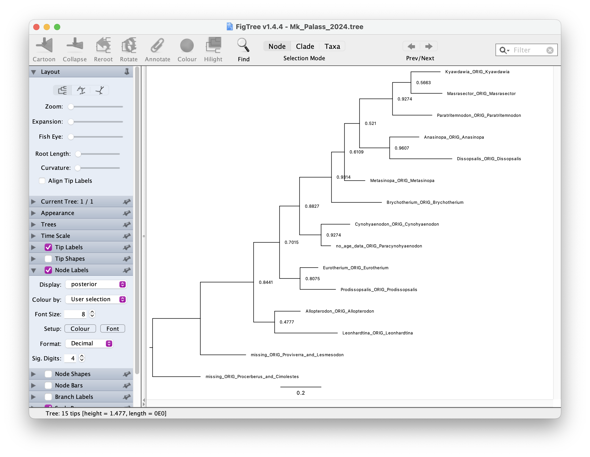

```{r setup, include=FALSE}
knitr::opts_chunk$set(echo = TRUE)
```

\

# Bayesian tree inference using RevBayes

In this exercise we'll estimate a tree of hyaenodonts ([Hyaenodonta](https://en.wikipedia.org/wiki/Hyaenodonta)) using morphological character data. The matrix is from [Egi et al.  2007](https://www.tandfonline.com/doi/abs/10.1017/S1477201905001707) and consists of 12 taxa and 65 characters $-$ you can download this [here](data/Egi.nex).  

We'll be using a Bayesian approach and a simple model of character evolution, the Mk model.

# Software

For this tutorial you'll need the following software

- [RevBayes](https://revbayes.github.io/download)
- [Tracer](https://github.com/beast-dev/tracer/releases/tag/v1.7.2)
- [FigTree](https://github.com/rambaut/figtree/releases)
- A program of your choice for editing scripts and code (e.g., [Sublime Text](https://www.sublimetext.com), [Visual Studio Code](https://code.visualstudio.com))

# Organising and editing your code

The current best way to run RevBayes on your computer is to edit your scripts using a source code editor, save these somewhere on your computer, along with your data, and call the Rev scripts from the RevBayes terminal.

Usually we organise files into sub-directories or folders $-$ one for data, one for scripts, and one for output. This can be useful for constructing complex or hierarchical models in a modular fashion. You can then simply call your "main" script using the command `source()`, in the same way as we would in R. We'll see an example of this below.

For this exercise you can create a folder called `exercise\_1` or something. Note its a good idea **not to include spaces** in your directory or script names, as these can be written and interpreted in different ways by different programs or operating systems.

Next create two sub-directories, `data` for your nexus file and  `scripts` for your code. For this tutorial we'll write two scripts:

  1. `main.Rev` for reading the data, setting up the tree model and MCMC settings
  2. `Mk.Rev`for the character evolution or substitution model

You can edit the scripts in a editor of your choice.

There is an experimental companion program to RevBayes called RevStudio, which is similar to RStudio, but this doesn't currently run well on all operating systems, therefore we do not recommend using it for now. 

# Opening RevBayes

## Mac 

On a Mac you can simply click on the `rb` executable to run it. This will open a RevBayes terminal window  (see image below). When you open it for the first time, you might see a security message - you can safely ignore this. 

```{r, echo=FALSE, out.width="60%",  out.extra='style="padding:5px"'}

```

Next you can navigate to the directory or folder on your computer that contains your scripts and data using the `setwd("<file path>")` command. And you can use the `getwd()` command to make sure you're in the right place. On my computer this would look like this:

```{r, echo=FALSE, out.width="60%",  out.extra='style="padding:5px"'}

```

You first need to identify the file path. The easiest way to do this is to right click the folder and select Copy.
If you then click paste in an editor or terminal it should print out the full file path. You can also drag and drop the folder into the terminal to reveal the file path.

Later we'll see how we can run your own scripts using the `source()` command.

## Windows

In Windows you can do the same as above using GitBash.

Can someone with experience in windows confirm this for me?

## The Rev langauge

RevBayes uses its own language, which has a lot in common with the R programming language. 
One of the main differences is that it includes an explicit set of commands and operators for setting up hierarchical or graphical models. You can learn more about and explore the Rev language [here](exercise-Rev.html).

Briefly, different types of operators are used to explicitly define different types of variables:

- `<-` is used for [constant variables](exercise-Rev.html#constant) that are fixed throughout your analysis, e.g., number of taxa
- `~` is used for [stochastic variables](exercise-Rev.html#stochastic) that are sampled from some underlying distribution and estimated during your analysis, e.g., the tree topology or branch lengths
- `:=` are used for [deterministic variables](exercise-Rev.html#deterministic) that can be transformed based on the values of other variables, e.g., total tree length is the sum of all branch lengths
- `=` are used to define variables that are not part of the model, e.g., the vector of MCMC moves

We'll see examples of all of these in setting up our analysis. 

## Read in the data and define helper variables

Start with your `main.Rev` script. First we need to read in the character matrix.

```{r data, eval=FALSE}
morpho <- readDiscreteCharacterData("data/Egi.nex")
morpho
```

Next we need to define some variables that will come in handy later for setting up our model.

```{r vars, eval=FALSE}
num_taxa <- morpho.ntaxa() # number of taxa
num_branches <- 2 * num_taxa - 3 # number of branches in an unrooted tree
taxa <- morpho.taxa() # list of taxon names
```

Note these are [constant](exercise-03.html#constant) variables.

Next we'll define a set of variables for setting up our MCMC. Note that we use `=` instead of `<-` because these variables are not part of the model. The `moves` vector is for storing our MCMC moves and the `monitors` vector is for storing the output. 

```{r vars2, eval=FALSE}
moves    = VectorMoves()
monitors = VectorMonitors()
```

## The uniform tree prior

For setting up regular Bayesian tree inference we need to specify two model components: 

  1. we need a prior on the topology and branch lengths 
  2. and we need to specify a character evolution or substitution model

First we'll set up the uniform tree prior in `main.Rev`. The following specifies a uniform prior on the **tree topology** $-$ this means that all possible tree configurations have the *same probability* under the prior. The tree is a [stochastic](exercise-03.html#stochastic) variable.

```{r tree_prior2, eval=FALSE}
topology ~ dnUniformTopology(taxa)
```

For every parameter we want to sample during MCMC we need to define one or more appropriate moves for that parameter. The function `moves.append()` adds specific moves to our `moves` vector. 

```{r tree_prior_moves, eval=FALSE}
moves.append( mvNNI(topology, weight = num_taxa) ) # nearest neighbour interchange
moves.append( mvSPR(topology, weight = num_taxa/10.0) ) # subtree pruning and regrafting
```

The above moves (NNI and SPR) are widely used for searching tree space. You can read more about the details [here](https://en.wikipedia.org/wiki/Tree_rearrangement). The "weight" argument tells the MCMC how much time to spend trying these moves, relative to all other moves. The weights specified above are simply a useful rule of thumb. 

```{r hidden_notes, eval=FALSE, echo=FALSE}
# weight = num_taxa
# weight = num_taxa/10.0

#TODO add **Note for windows users**

#TODO: add an explanaition of the dnPhyloCTMC - more?
#TODO: color inline files and directories, could use " "?
#TODO: add the scripts

```

Next we need to specify a prior on the **branch lengths**. We'll do this using an exponential distribution. In the following loop, for every branch in the tree (`num_branches`) we define a stochastic node using an exponential prior distribution, along with an appropriate move. This parameter is a continuous variable that can be any real number value >0, so we'll use a so-called scale move.

```{r br_lengths, eval=FALSE}
for (i in 1:num_branches) {
   br_lens[i] ~ dnExponential(10.0) # mean of this distribution 10
   moves.append( mvScale(br_lens[i]) )
}
```

Using the Rev language we can also put a prior on the mean of the distribution used to specify branch lengths (see next [exercise](ModelAdequacy.html.html) for example).

The tree we're interested in and the one we use to calculate the likelihood combines the topology and branch lengths, which we can define using a  [deterministic](exercise-03.html#deterministic) variable.

```{r tree, eval=FALSE}
phylogeny := treeAssembly(topology, br_lens)
phylogeny
```

It might also be interesting to monitor the total tree length. We can do this by defining another deterministic node.

```{r br_lengths_sum, eval=FALSE}
TL := sum(br_lens)
```

## The Mk Lewis model

Now that we've specified the tree prior, we'll go ahead and set up the character evolution model, using the Lewis Mk model, which makes the same assumptions as the Jukes-Cantor subsitution model used for molecular data.
Let's do this in a separate file called `Mk.Rev`.

We'll define a **Q matrix** for 5 states (0, 1, 2, 3, 4, 5) using the `fnJC` function. Under this model rates of change between states and state frequencies (the proportion of each character state) are assumed to be equal. Later we'll see what happens when we relax this assumption.

```{r Q, eval=FALSE}
Q <- fnJC(5)
Q
```

Next we'll define a stochastic node representing a character matrix and "clamp" that variable to our observed character data.

```{r seq, eval=FALSE}
seq ~ dnPhyloCTMC(tree = phylogeny, Q = Q, type = "Standard")
seq.clamp(morpho)
```

This basically tells the program to calculate the likelihood for this data using the character evolution model specified using the function arguments (i.e., calculate the likelihood for our tree using the Mk model represented by the Q matrix). We don't need to add any additional moves here because we're not estimating any extra parameters. Type refers to the data type, e.g., DNA. "Standard" refers to integers, which includes discrete morphological data.

It might seem a bit overkill to have such a small number of code lines in a separate script but as the models become more complex you'll see why this becomes useful. 

Return to your main script `main.Rev` and add the following line. This tells the program to read and execute the script containing details of the character evolution model.

```{r source, eval=FALSE}
source("scripts/Mk.Rev")
```

## MCMC settings

Before we run the analysis we just need to finish setting up the MCMC.

Add the following line to create the variable `mymodel`. This is a special variable that gets passed to the MCMC functions. We can actually do this using any variable in our hierarchical model, I've just arbitrarily used `phylogeny` here. 

```{r model, eval=FALSE}
mymodel = model(phylogeny)
mymodel
```

If you look at the output you'll see a list of all the parameters in your model. See if you can work out what they are.

Next we'll define a set of **monitors** so we can record the output. 
`printgen` specifies the frequency with which we output or record the parameters during the MCMC run.

```{r monitors, eval=FALSE}
# parameters printed to file
monitors.append( mnModel(filename = "output/Mk_Palass_2024.log", printgen = 10) )
# trees printed to file
monitors.append( mnFile(filename = "output/Mk_Palass_2024.trees", printgen = 10, phylogeny) )
# parameter values printed to screen during the MCMC
monitors.append( mnScreen(printgen = 100, TL) )
```

Finally, we'll set up the MCMC run using the `mcmc` function, specifying our model, the vector of monitors and the vector of moves. And then we'll run the chain for 1000 generations.

```{r mcmc, eval=FALSE}
mymcmc = mcmc(mymodel, monitors, moves)
mymcmc.run(generations = 1000)
```

To run this analysis in RevBayes, change directory or open the program in the directory you created for this exercise and then run the job using the `source` command.

```{r run, eval=FALSE}
source("scripts/main.Rev")
```

## Evaluating the output

During the MCMC run, the program should have created the folder `output` containing the `.log` and `.trees` files. Open these in a text editor. 

>What do you make of the contents of the log and tree files?

The first thing we want to check is **convergence**. We can do this using the program Tracer.
Open Tracer and drag and drop your `.log` file into the panel on the left or you can go to File > Import Trace File. What you see should look something like this.

```{r, echo=FALSE, out.width="85%",  out.extra='style="padding:10px"'}

```

Explore the output, including the Trace panel at the top.

>What do the histograms represent? Do you think our analysis has reached convergence?

There are some indicators that our analyses *haven't* converged, including the ESS values which are highlighted in orange and red, and the trace plots.
This means we haven't adequately approximated the posterior parameter space. 

Let's increase the chain length to 20000 and rerun the MCMC. This will take a bit longer to run.

You're already getting a flavour for how long MCMC analyses can take. It's very common to have to run empirical analyses for millions+ generations and it can take several days for a single analysis.

Once your longer run is complete, open the file again in Tracer. Your new output should look something like this.

```{r, echo=FALSE, out.width="85%",  out.extra='style="padding:10px"'}

```

> What differences do you notice in the output? 

Actually, if wanted to use this output for publication, we'd still want to run the chain for longer because some parameters still haven't mixed well but let's move on for now.

Back in RevBayes we can also generate summary trees. We'll use the maximum a posteriori (MAP) tree $-$ this is the tree with the highest posterior probability. This is just one way of summarising the posterior distribution of trees. 

It is important to note the summary tree is not the "true" result $-$ the entire posterior distribution (which might contain many different trees) is the full result. 

```{r MAP, eval=FALSE}
# read the tree file back in
treetrace = readTreeTrace("output/Mk_Palass_2024.trees", treetype = "non-clock")
# generate a MAP tree
map_tree = mapTree(treetrace, "output/Mk_Palass_2024.tree")
```

You can open this tree in FigTree. Root the tree along the branch leading to `"missing_ORIG_Procerberus_and_Cimolestes` $-$ this is our outgroup, a group of small early mammals called cimolestids.
Next let's look at the node support. Go to Node Labels > Display > posterior.
Your output should look something like this.

```{r, echo=FALSE, out.width="85%",  out.extra='style="padding:10px"'}

```

> How would you interpret the node support values?

A complete set of scripts for this exercise can be downloaded [here](scripts/exercise04-scripts.zip).

